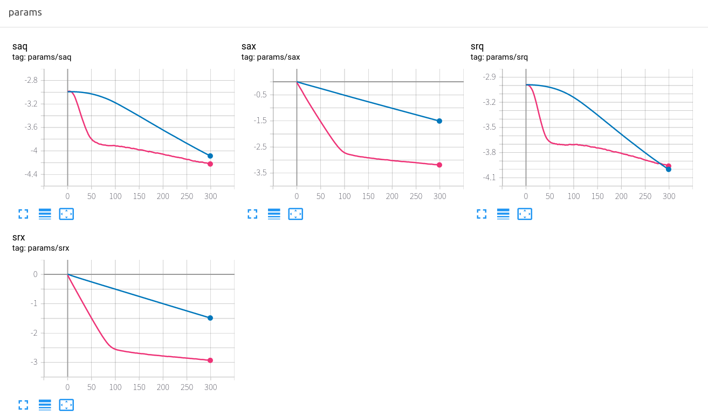
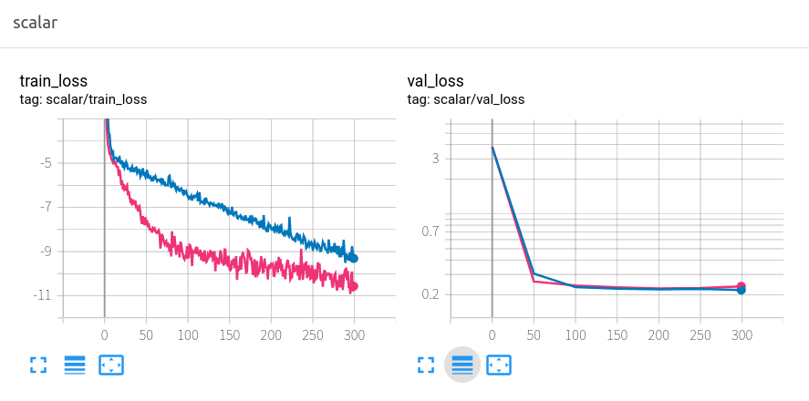
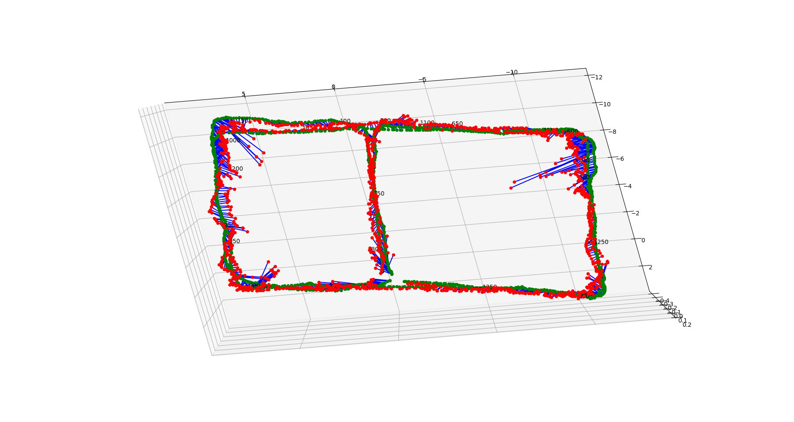
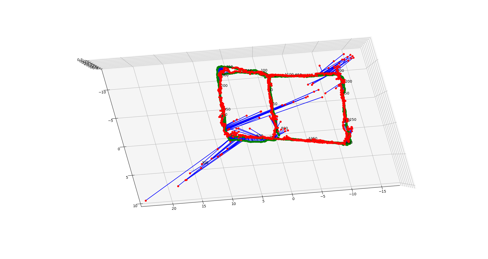

This is the PyTorch implementation of the `MapNet` for 

"[Geometry-Aware Learning of Maps for Camera Localization](https://arxiv.org/abs/1712.03342)" - CVPR 2018 (Spotlight).

`MapNet++` and `MapNet+PGO` are **NOT** implemented in this repository. 

The code was forked from official PyTorch implementation: https://github.com/NVlabs/geomapnet

# dependences:

- Python 3.6
- PyTorch 1.5.1 + Torchvision 0.6.1
- mmcv
- numpy
- matplotlib
- scipy
- colour-demosaicing
- transforms3d

# Main work

This repository made the following modifications compared to official implements:

- update Python 2.7 to Python 3.6

- update PyTorch 0.4.1 to PyTorch 1.5.1

- Manage the classes (DATASET, MODEL, BACKBONE, CRITERION, OPTIMIZER) with a unified Register in `mmcv` for code simplicity

- Parameters are all specified with `.yaml` configure files. For example, the configure for training and testing the `mapnet` on `SevenScenes` is as follows:

  ```yaml
  common:
    n_epochs: 300
    batch_size: 20
    do_val: True
    seed: 7
    shuffle: True
    num_workers: 5
    snapshot: 50
    val_freq: 50
    max_grad_norm: 0
    print_freq: 20
    cuda: True
  
  model:
    type: MapNet
    backbone:
      type: ResNet34
      pretrained: True
    pretrained: True
    droprate: 0.5
    feat_dim: 2048
  
  transform:
    size: 256
    color_jitter: 0.7
    mean:
      - 0.4943200
      - 0.4268097
      - 0.4339257
    std:
      - 0.20226764
      - 0.21839666
      - 0.20558356
  
  dataset:
    type: MF
    name: SevenScenes
    no_duplicates: False
    scene: chess
    data_path: data/deepslam_data/SevenScenes
    mean_t:
      - 0.0
      - 0.0
      - 0.0
    std_t:
      - 1.0
      - 1.0
      - 1.0
    mode: 0
    skip_images: False
    skip: 10
    steps: 3
    variable_skip: False
  
  train_loss:
    type: MapNetCriterion
    sax: 0.0
    saq: -3.0
    srx: 0.0
    srq: -3.0
    learn_beta: True
    learn_gamma: True
  
  val_loss:
    type: MapNetCriterion
    sax: 0.0
    saq: 0.0
    srx: 0.0
    srq: 0.0
    learn_beta: False
    learn_gamma: False
  
  optim:
    type: Optimizer
    method: adam
    base_lr: 1.0e-4
    weight_decay: 0.0005
  ```


- use `Tensorboard` for training visualization.

  

 

for training and testing, using the command below:

- training `mapnet` on `SevenScenes` `chess`

```shell
python tools/train.py --config_file configs/7scenes/mapnet_chess.yaml --logdir logs/mapnet_chess/
```

The `logdir` will be created automatically which includes the following information:

1. training log file.
2. checkpoints every N epochs (default 50).
3. Tensorboard events for visualizing the training process.

- run validation process with `mapnet` on `SevenScenes` `chess`

```shell
python tools/eval.py --config_file configs/7scenes/mapnet_chess.yaml --weights logs/mapnet_chess/epoch_200.pth.tar --show --val
```

where `--show` means drawing result and `--val` means run validation on val set. For more details about the arguments of `eval.py`, please run:

```shell
python tools/eval.py --help
```

Experimental result with `mapnet` on `SevenScenes` :

| Scene       | official result      | result                            |
| ----------- | -------------------- | --------------------------------- |
| Chess       | 0.08 m, 3.25 degree  | 0.13 m, 4.87 degree (250 epochs)  |
| Fire        | 0.27 m, 11.69 degree | 0.37 m, 11.93 degree (250 epochs) |
| Heads       | 0.18 m, 13.25 degree | 0.19 m, 13.23 degree              |
| Office      | 0.17 m, 5.15 degree  | 0.22 m, 6.56 degree               |
| Pumpkin     | 0.22 m, 4.02 degree  | 0.28 m, 5.97 degree (200 epochs)  |
| Kitchen     | 0.23 m, 4.93 degree  | 0.28 m, 5.83 degree (200 epochs)  |
| Stairs      | 0.30 m, 12.08 degree | 0.35 m, 10.99 degree              |
| **Average** | 0.21 m, 7.77 degree  | 0.26 m, 8.48 degree               |

Experimental results with on our own data `UnoRobot`:

| Model   | translate | rotation    |
| ------- | --------- | ----------- |
| MapNet  | 0.44 m    | 4.19 degree |
| PoseNet | 0.64 m    | 4.45 degree |




